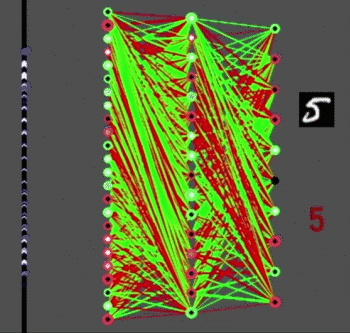
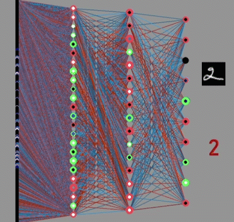
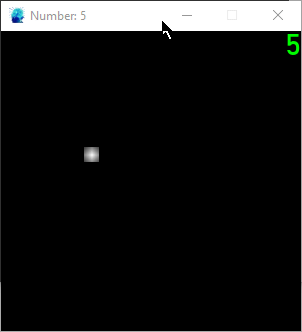

# basic-neural-net
A multilayer perceptron (MLP) network made without the use of any machine learning libraries, for use with MNIST/EMNIST datasets solely for now. Also includes a real-time number/letter identifier using trained network files, as well as scripts to graph the actual weights/biases or the evolution of cost over time.

This was a fun project to check if I could create a simple deep learning network w/o all the abstraction of libraries, and without referencing any existing code for this purpose. Seeing a program "learn" from simple maths is pretty neat once you don't obscure any details! All my knowledge for this project came from 3b1b's [neural network playlist](https://www.youtube.com/watch?v=aircAruvnKk&list=PLZHQObOWTQDNU6R1_67000Dx_ZCJB-3pi).

To train the network yourself, download the MNIST/EMNIST datasets from the original sources, extract from the .gz, and place the extracted files in the folders.

### mlp_sigmoid_emnist.py
The program to train and test networks. First, make sure the required dataset is downloaded and placed in the correct folder. Execute directly to randomly initialise a new network (change parameters like neurone counts in the Network() initialisation) and begin training/testing, or *drag and drop* an **npz** file (saved network) onto this script to train/test with the saved network.

For faster training, disable drawing the first layer's weights with `draw_l1=False`, or disable drawing entirely with `draw=False` in the Network() call (the pygame window will still open), since drawing takes ~0.1s for even a (784, 24, 16, 10) network. The trained network will also be autosaved once training finishes or you close the pygame window while training; disable this with `save=False`.

I'll make a parallelised version sometime that will hopefully work better on more complex datasets, like EMNIST letters!

### number_identifier_mnist.py
Uses a saved network to guess a drawn number in real time. Drag and drop an **npz** file to use it for guessing. Note that at present, networks trained on the original MNIST seem to perform the best; this may be due to image preprocessing differences with EMNIST, so I will try to fix that later. Plus, letters are magnitudes more complex than numbers...

LMB for drawing, RMB for erasing, mouse wheel to change "brush" width, and R to reset board.

### graphing scripts
**weightsbiases_hist.py:** graphs the distributions of the actual weights and biases in a trained network. Drag and drop two or more networks onto this script to plot multiple distributions together, and disable weights or biases using `SHOW_WEIGHTS` and `SHOW_BIASES`. Interestingly, the distributions roughly remain as normal distributions (how they were initialised).

**logs/percent_plotter.py and cost_plotter.py:** graph the evolution of the cost/accuracy during training. For now, the text output of the training must be copied, placed in a textfile, and dragged and dropped onto these scripts to plot the curves; I'll make an automated CSV logger later. Multiple graphs can also be plotted by dropping multiple files! 